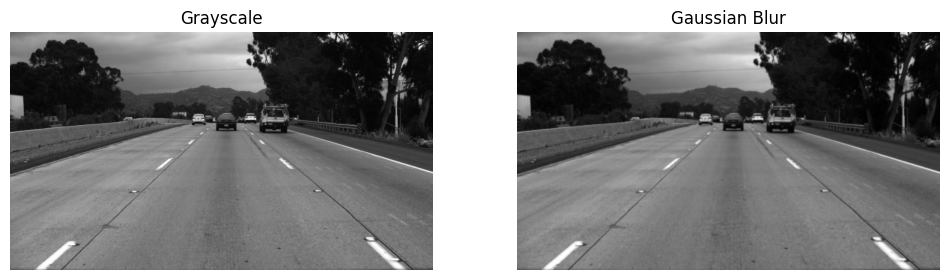
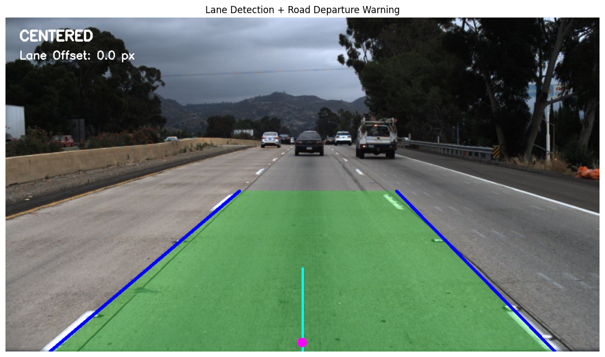
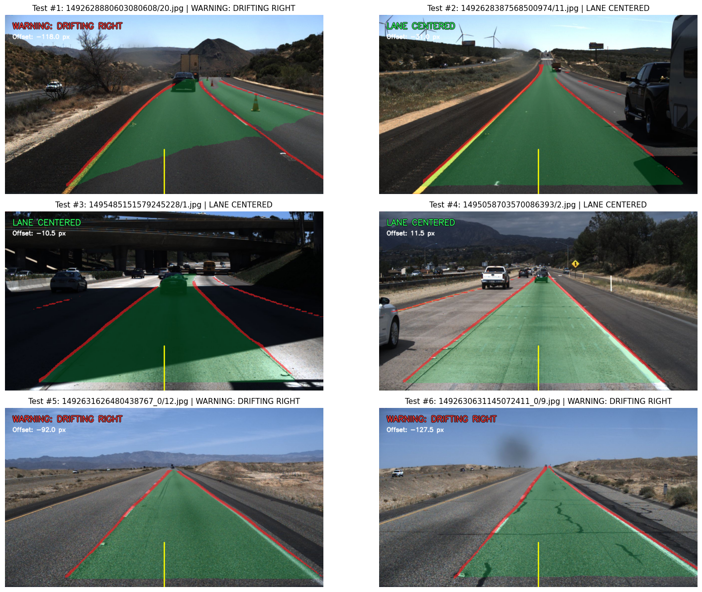
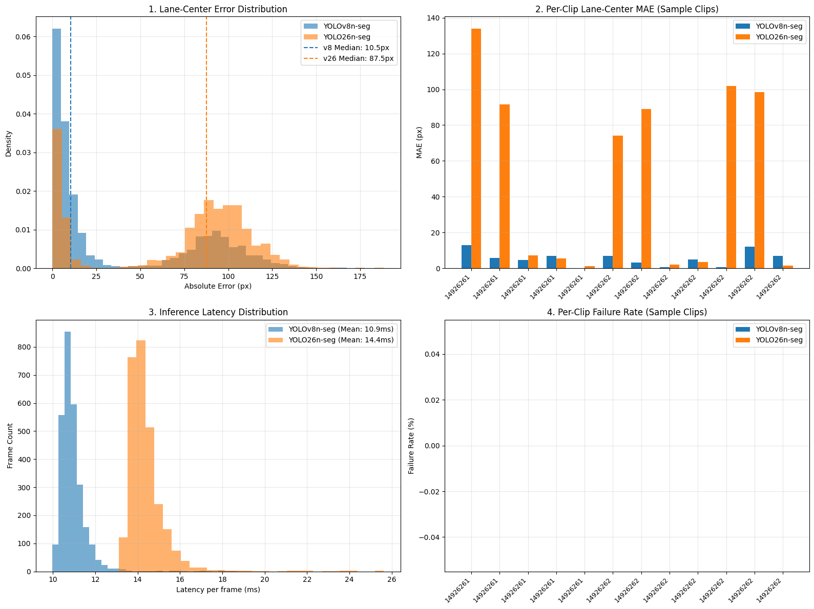
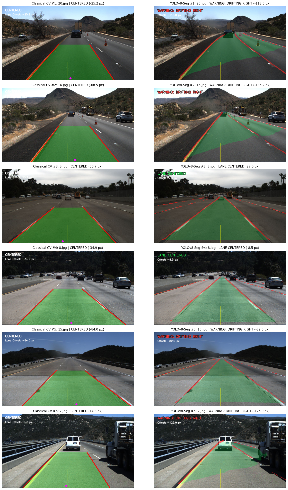
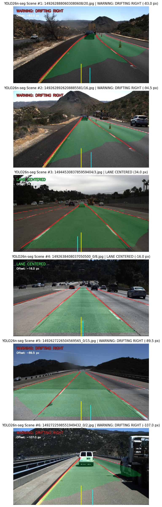

# LaneGuard: Comparative Study of Classical Computer Vision and Learned Segmentation for Monocular Lane Perception

[](https://www.python.org/)
[](https://opencv.org/)
[](https://pytorch.org/)
[](https://github.com/ultralytics/ultralytics)
[](https://github.com/TuSimple/tusimple-benchmark)
[](LICENSE)

> **Repository Description**: Comparative monocular lane perception study using classical computer vision, YOLOv8n-seg, and YOLO26n-seg on the TuSimple dataset.

LaneGuard is an applied computer-vision comparative study of monocular lane perception using classical image-processing heuristics and lightweight learned segmentation models. It examines the operational characteristics, localization accuracy, inference latency, and departure-warning behavior of rule-based geometric vision and deep-learning segmentation on highway imagery.

---

## Research Question

How do classical edge- and geometry-based lane detection pipelines compare with lightweight learned segmentation models in terms of implementation complexity, inference latency, qualitative behavior across highway road geometries, and suitability for heuristic lane-departure warning when evaluated on forward-facing monocular imagery?

---

## Project Scope

LaneGuard is an applied computer-vision comparative study designed to examine the operational differences between hand-crafted geometric vision rules and learned semantic masks. 

The implementation operates strictly in two-dimensional image pixel space on individual monocular video frames. It does not perform metric camera calibration, Inverse Perspective Mapping (IPM) to Bird's-Eye-View (BEV), vehicle state estimation, or CAN bus interfacing. It is not an autonomous driving system, not a production ADAS solution, and carries no functional safety certification under ISO 26262 or related automotive standards.

---

## Dataset

All experiments use highway imagery from the [TuSimple Lane Detection Benchmark](https://github.com/TuSimple/tusimple-benchmark). 

TuSimple sequences consist of forward-facing camera video clips ($1280 \times 720$ resolution) recorded under predominantly dry, clear-weather daytime highway driving conditions.

### Annotation Format

Ground-truth lane markings in TuSimple are annotated as polylines defined across predefined vertical scanlines:
- `h_samples`: Discrete vertical pixel coordinates ($y \in [160, 710]$ at $10\text{ px}$ intervals).
- `lanes`: Horizontal pixel coordinates ($x$) corresponding to each height, where $-2$ denotes an unannotated or occluded scanline.

---

## Dataset and Label Construction

TuSimple supplies lane polylines rather than semantic or instance segmentation masks. Training masks for the learned pipeline were generated programmatically from these polyline coordinates:

1. **Lane Line Ribbons (`lane_line`)**:
   - Discrete $(x, y)$ polyline points for each annotated lane were dilated horizontally by $\pm 6\text{ px}$ (`thickness=6`) to form closed ribbon polygons.
   - Coordinates were normalized to $[0, 1]$ for the YOLO segmentation format.
2. **Derived Corridor Masks (`drivable_area`)**:
   - The two innermost lane boundaries closest to the horizontal center of the frame ($x = 640\text{ px}$) were identified.
   - A closed polygon was constructed between these two lines across their shared vertical height span.

> **Methodological Clarification on Labels**: TuSimple provides lane marking annotations. The corridor masks used for the segmentation experiment are derived directly from these lane coordinates. They must be interpreted as derived lane-corridor targets rather than independently annotated drivable-area ground truth. They do not represent curbs, road shoulders, or unstriped boundaries, and they do not account for dynamic obstacles.

---

## Dataset Splits and Temporal Considerations

The experimental evaluation distinguishes between two separate dataset partitions:

### 1. Training and Validation Split (600 / 150 Frames)
Constructed from the 3,626 annotated frames in the TuSimple training set (`label_data_0601.json`, `label_data_0313.json`, `label_data_0531.json`):
- **Training Subset**: 600 frames (`images/train`, `labels/train`)
- **Validation Subset**: 150 frames (`images/val`, `labels/val`), containing 710 ground-truth target instances (560 `lane_line` instances, 150 `drivable_area` instances)
- **Qualitative Case Set**: 6 frames sampled across the dataset for detailed visual inspection.

> **Methodological Limitation (Frame-Level Split and Temporal Adjacency)**: In this experiment, frames were partitioned using uniform random shuffling at the individual frame level (`np.random.seed(42)`). Because TuSimple sequences are organized as continuous 20-frame video clips recorded at 1-second intervals, random frame-level shuffling distributes temporally adjacent frames from the same driving sequence across both the training and validation subsets. Consequently, the reported validation metrics evaluate interpolation on familiar scenes and may contain temporally adjacent frames; they should not be interpreted as an evaluation of out-of-distribution sequence-level generalization.

### 2. Held-Out Evaluation Set (2,782 Frames)
Generalization performance was separately evaluated on **2,782 evaluation frames from the official TuSimple test set** (`test_label.json`), indexed via a standardized evaluation manifest (`results/evaluation_manifest.csv`). 

- The evaluation manifest contains 2,782 frames.
- No overlapping evaluation frames were identified between the training subset and the held-out TuSimple test evaluation.
- The 2,782 evaluation frames were evaluated individually; they are not treated as independent continuous video streams in this frame-level benchmark.

---

## Methods

### Classical Pipeline

Implemented in [`laneguard.ipynb`](laneguard.ipynb), the classical pipeline relies on deterministic image processing without trainable parameters:

1. **HLS Color Space Filtering**:
   - Converts the input RGB frame to HLS color space.
   - White markings: $H \in [0, 255]$, $L \in [185, 255]$, $S \in [0, 255]$.
   - Yellow markings: $H \in [10, 40]$, $L \in [60, 255]$, $S \in [60, 255]$.
   - A bitwise OR combines the masks to preserve marking pixels under daylight contrast.
2. **Gaussian Smoothing and Canny Edge Detection**:
   - Grayscale conversion followed by a $5 \times 5$ Gaussian blur kernel.
   - Canny edge detection with hysteresis thresholds $T_{\text{low}} = 50$, $T_{\text{high}} = 150$.
   - Combined with the HLS mask via bitwise OR.
3. **Trapezoidal Region of Interest (ROI)**:
   - Masks the upper visual field on $1280 \times 720$ frames:
     - Bottom vertices: $(0, 720)$ and $(1280, 720)$
     - Top vertices: $(768, 360)$ and $(512, 360)$
4. **Probabilistic Hough Transform**:
   - Line segment detection using `cv2.HoughLinesP` ($\rho = 1\text{ px}$, $\theta = \pi / 180$, accumulator threshold $= 35$, minimum line length $= 30\text{ px}$, maximum line gap $= 80\text{ px}$).
5. **Slope Partitioning and Outlier Filtering**:
   - Calculates segment slope as $m = \Delta x / \Delta y$. Segments with $|\Delta y| < 15\text{ px}$ or $|m| < 0.25$ or $|m| > 2.5$ are rejected.
   - Segments are partitioned into left candidates ($x_{\text{mid}} < 0.52 \cdot W$, $m < 0$) and right candidates ($x_{\text{mid}} > 0.48 \cdot W$, $m > 0$).
   - The median slope $m_{\text{med}}$ is computed per candidate pool; segments deviating by $|m - m_{\text{med}}| \ge 0.35$ are discarded.
6. **First-Order Linear Fitting**:
   - Inlier segment endpoints are fitted to a first-order linear model ($x = my + b$) using least squares (`np.polyfit(y, x, 1)`).
   - If one boundary is missing, `complete_single_lane` synthesizes the opposing line using assumed highway perspective dimensions ($850\text{ px}$ lane width at the bottom, $280\text{ px}$ at the horizon).
   - *Exploratory Prototype Note*: A standalone second-order polynomial routine (`polynomial_lane_fit`) is implemented in `laneguard.ipynb` Cell 38, but it was not integrated into `detect_lanes` or used in the comparative evaluations.
7. **Temporal Smoothing**:
   - A moving-average buffer (`LaneSmoother`) maintains a FIFO queue of up to 8 recent boundary fits (`deque(maxlen=8)`), averaging coefficients across consecutive video frames.


*Figure 1: Deterministic feature engineering stages of the classical CV pipeline: HLS color thresholding, Canny edge detection, trapezoidal ROI extraction, and Hough accumulator voting.*


*Figure 2: Fitted linear highway boundaries, synthesized green drivable corridor, and Heads-Up Display (HUD) indicating lateral offset and departure warning status.*

### Learned Pipelines

LaneGuard implements and evaluates two deep-learning segmentation models fine-tuned under an identical training protocol:

#### 1. YOLOv8n-seg Baseline
Implemented in [`laneguard_yolo.ipynb`](laneguard_yolo.ipynb):
- **Architecture**: Anchor-free detection backbone with C2f feature aggregation, decoupled detection/segmentation head, and non-maximum suppression (85 fused layers, 3,258,454 parameters, 11.3 GFLOPs at $640 \times 640$).
- **Classes**: Class 0 (`lane_line` ribbons) and Class 1 (`drivable_area` derived corridor polygon).
- **Post-Processing**: Output masks resized to $1280 \times 720$. Boundary coordinates are sampled at near-bumper row $y = 680\text{ px}$ with a $\pm 5\text{ px}$ window. If one boundary is missing, the fixed $\pm 420\text{ px}$ fallback heuristic is applied.


*Figure 3: Semantic mask predictions and HUD outputs produced by fine-tuned YOLOv8n-seg across representative highway scenes.*

#### 2. YOLO26n-seg Modern Baseline
Implemented in [`LaneGuard_YOLO26n_Segmentation.ipynb`](LaneGuard_YOLO26n_Segmentation.ipynb):
- **Architecture**: Lightweight segmentation model evaluated using the Ultralytics implementation in this study (incorporating C3k2 feature blocks, C2PSA attention, and Segment26 head; 136 fused layers / 309 unfused layers, 2,689,274 fused parameters, 9.1 GFLOPs at $640 \times 640$).
- **Computational Footprint**: In this configuration, YOLO26n-seg uses approximately 17.5% fewer parameters (569,180 fewer weights) and 19.5% lower reported FLOPs (2.2 GFLOPs lower at $640 \times 640$) compared to YOLOv8n-seg.
- **Harmonized Evaluation Logic**: Evaluated using the exact same evaluation manifest (`results/evaluation_manifest.csv`), scanline sampling ($y = 680\text{ px}$), single-boundary fallback ($\pm 420\text{ px}$), and LDWS thresholding ($\pm 80\text{ px}$).

---

## Evaluation Protocol and Methodology

To maintain transparent evaluation across models, the quantitative assessment uses a standardized geometric measurement pipeline:

1. **Image Coordinate System**:
   - Origin $(0, 0)$ is at the top-left corner of the image.
   - Image width $W = 1280\text{ px}$ ($x \in [0, 1280]$), image height $H = 720\text{ px}$ ($y \in [0, 720]$).
   - Vehicle center is assumed to correspond to the horizontal midpoint at the bottom edge: $x_{\text{vehicle}} = W / 2 = 640\text{ px}$.

2. **Evaluation Scanline ($y = 680\text{ px}$)**:
   - Spatial localization is measured at near-bumper scanline $y = 680\text{ px}$ using a vertical window of $\pm 5\text{ px}$ ($y \in [675, 685]$).
   - This scanline corresponds to the lower portion of the visible road surface where lateral lane position directly determines departure state.

3. **Predicted Lane Boundary Extraction**:
   - Binary segmentation masks for Class 0 (`lane_line`) are resized to $1280 \times 720$.
   - Positive mask pixels within the scanline window ($y \in [675, 685]$) are partitioned into left candidates ($x < 640$) and right candidates ($x > 640$).
   - If candidate pixels exist, the boundary estimate is the median horizontal coordinate:
     $$\hat{x}_{\text{left}} = \text{median}(x_{\text{candidate, left}}), \quad \hat{x}_{\text{right}} = \text{median}(x_{\text{candidate, right}})$$

4. **Ground-Truth Lane Coordinates**:
   - Evaluated directly from the TuSimple polyline annotations at vertical coordinate $h = 680\text{ px}$.
   - Valid coordinates ($x \ge 0$) are partitioned around $x = 640\text{ px}$:
     $$x_{\text{gt, left}} = \max(x < 640), \quad x_{\text{gt, right}} = \min(x > 640)$$
   - Ground-truth lane center is defined as the midpoint when both boundaries are present:
     $$x_{\text{gt, center}} = \frac{x_{\text{gt, left}} + x_{\text{gt, right}}}{2}$$

5. **Missing Boundary Handling and Lane Center Estimation**:
   - **Both boundaries detected**: Estimated lane center is the arithmetic mean:
     $$\hat{x}_{\text{center}} = \frac{\hat{x}_{\text{left}} + \hat{x}_{\text{right}}}{2}$$
   - **Single boundary detected**: A fixed project-level fallback offset of $420\text{ px}$ (half of the nominal $840\text{ px}$ near-bumper lane width) is applied:
     $$\hat{x}_{\text{center}} = \begin{cases} \hat{x}_{\text{left}} + 420.0\text{ px} & \text{if only left boundary detected} \\ \hat{x}_{\text{right}} - 420.0\text{ px} & \text{if only right boundary detected} \end{cases}$$
   - **Neither boundary detected**: Lane center cannot be estimated, and the frame is recorded as a detection failure (`is_failure = True`).

6. **Metric Definitions and Cohorts**:
   - **Lane Boundary MAE / RMSE**: Mean absolute error and root mean square error between predicted and ground-truth boundary coordinates, averaged across all detected boundaries with matching ground truth.
   - **Lane Center MAE / RMSE / Median AE**: End-to-end geometric lane-center error computed across frames where both estimated lane center $\hat{x}_{\text{center}}$ and ground-truth center $x_{\text{gt, center}}$ are available (2,599 frames for YOLOv8n-seg; 1,957 frames for YOLO26n-seg).
   - **Detection Failure Rate**: Percentage of frames in which neither boundary was detected above the confidence threshold ($0.25$), preventing lane-center estimation.

> [!IMPORTANT]
> **Pipeline Dependency of Lane-Center Error**: Lane-center error reflects the complete lane-position estimation pipeline, including boundary selection and the fixed single-boundary recovery heuristic; it should therefore not be interpreted as a pure segmentation quality metric. When only one boundary is detected, the static $\pm 420\text{ px}$ assumption can introduce significant geometric error on curves or roads with non-standard lane widths.

---

## Experimental Setup

| Parameter | Classical Pipeline | Learned YOLOv8n-seg Baseline | Learned YOLO26n-seg Baseline |
| :--- | :--- | :--- | :--- |
| **Notebook Implementation** | [`laneguard.ipynb`](laneguard.ipynb) | [`laneguard_yolo.ipynb`](laneguard_yolo.ipynb) | [`LaneGuard_YOLO26n_Segmentation.ipynb`](LaneGuard_YOLO26n_Segmentation.ipynb) |
| **Model Weights** | Algorithmic (OpenCV 4.x) | `yolov8n-seg.pt` (3.26M params, 6.8 MB) | `yolo26n-seg.pt` (2.69M params, 6.5 MB) |
| **Detection Head** | Deterministic grouping | Standard Decoupled NMS Head | Native End-to-End Head |
| **Training Budget** | None (Rule-based) | 15 epochs, batch 16, 600 frames | 15 epochs, batch 16, 600 frames |
| **Input Resolution** | $1280 \times 720$ | $640 \times 640$ (network) $\rightarrow$ $1280 \times 720$ (HUD) | $640 \times 640$ (network) $\rightarrow$ $1280 \times 720$ (HUD) |
| **Evaluation Platform** | Host CPU | NVIDIA Tesla T4 GPU (16 GB VRAM) | NVIDIA Tesla T4 GPU (16 GB VRAM) |
| **Timing Metric** | Wall-clock `time.perf_counter()` | Synchronized CUDA Timing (`torch.cuda.synchronize()`) | Synchronized CUDA Timing (`torch.cuda.synchronize()`) |
| **Evaluation Cohort** | Qualitative inspection on 6 representative frames | Quantitative evaluation on 2,782 held-out TuSimple test frames | Quantitative evaluation on 2,782 held-out TuSimple test frames |

---

## Quantitative Results

### 1. Training/Validation Split Performance (150 Frames)

Validation metrics were recorded on the 150 validation frames (710 ground-truth target instances) at epoch 15 for both learned architectures under identical hyperparameters (batch size 16, input size 640, seed 42):

| Target Class | Metric | YOLOv8n-seg | YOLO26n-seg | Descriptive Observation |
| :--- | :--- | :---: | :---: | :--- |
| **Overall (All Classes)** | **Box Precision** | **0.953** | 0.946 | High bounding box precision across both models |
| | **Box Recall** | **0.932** | 0.915 | YOLOv8n-seg records higher box recall (+1.7%) |
| | **Box mAP@0.50** | **0.963** | 0.957 | Coarse bounding box mAP within 0.6% |
| | **Box mAP@0.50:0.95** | **0.828** | 0.823 | Tight-IoU bounding performance within 0.5% |
| | **Mask Precision** | **0.647** | 0.641 | Mask precision matched within 0.6% |
| | **Mask Recall** | **0.632** | 0.618 | YOLOv8n-seg records 1.4% higher mask recall |
| | **Mask mAP@0.50** | **0.544** | 0.537 | Overall mask mAP@0.50 within 0.7% |
| | **Mask mAP@0.50:0.95** | **0.369** | 0.359 | Strict mask IoU metric matched within 1.0% |
| **`lane_line` (Class 0)** | Mask mAP@0.50 | 0.260 | **0.274** | YOLO26n-seg records +1.4% higher ribbon mAP |
| | Mask mAP@0.50:0.95 | 0.0567 | **0.0606** | YOLO26n-seg records higher tight-IoU ribbon mAP |
| **`drivable_area` (Class 1)** | Mask mAP@0.50 | **0.828** | 0.801 | YOLOv8n-seg captures derived corridor target higher |
| | Mask mAP@0.50:0.95 | **0.681** | 0.657 | YOLOv8n-seg records higher continuous corridor overlap |

The relatively low mask metrics for `lane_line` across both models (mAP@0.50 of ~0.26–0.27) stem from two structural factors:
1. **Narrow Ribbon IoU Penalty**: Road markings are narrow ribbons ($\pm 6\text{ px}$ width). A spatial displacement of only 2–3 pixels heavily penalizes Intersection over Union (IoU).
2. **Constrained Training Schedule**: Both models were trained for a fixed schedule of 15 epochs on 600 frames.

---

### 2. Full Held-Out Evaluation (2,782 Frames from Official TuSimple Test Set)

To evaluate spatial error and runtime characteristics on held-out test data, both models were evaluated against **2,782 evaluation frames from the official TuSimple test set** (`test_label.json`), indexed by `results/evaluation_manifest.csv`. No overlapping evaluation frames were identified between the training subset and the held-out TuSimple test evaluation.

Both evaluations executed under identical conditions using scanline $y = 680\text{ px}$, confidence threshold $0.25$, and NVIDIA Tesla T4 execution with CUDA synchronization.


*Figure 4: Comparative evaluation across 2,782 evaluation frames from the official TuSimple test set. (Top-Left) Spatial pixel error distributions for boundary and center estimates at near-bumper scanline $y = 680\text{ px}$. (Top-Right) Per-frame Mean Absolute Error distribution across evaluated frames. (Bottom-Left) Synchronized CUDA runtime latency distributions on NVIDIA Tesla T4. (Bottom-Right) Detection failure rate comparison.*

#### Measured Benchmark Summary

All metrics below represent actual measured values recorded during execution on an NVIDIA Tesla T4 GPU (persisted in [`results/yolov8_vs_yolo26_summary.csv`](results/yolov8_vs_yolo26_summary.csv)):

| Evaluation Metric | YOLOv8n-seg Baseline | YOLO26n-seg Modern Baseline | Measured Comparison & Notes |
| :--- | :---:| :---:| :--- |
| **Evaluated Frames** | 2,782 frames | 2,782 frames | Standardized evaluation manifest (`results/evaluation_manifest.csv`) |
| **Test Data Source** | `test_label.json` (TuSimple test set) | `test_label.json` (TuSimple test set) | No overlapping evaluation frames identified with training subset |
| **Spatial Evaluation Scanline** | $y = 680\text{ px}$ (Near Bumper) | $y = 680\text{ px}$ (Near Bumper) | Evaluated over vertical window $y \in [675, 685]$ |
| **Lane Boundary MAE** | **21.42 px** | 22.44 px | Difference in boundary MAE is 1.02 px (~4.8%) |
| **Lane Boundary RMSE** | **23.39 px** | 23.59 px | Difference in boundary RMSE is 0.20 px |
| **Lane Boundary Median AE** | **21.00 px** | 22.50 px | Median boundary error differs by 1.50 px |
| **Lane Center MAE** | **37.62 px** | 70.06 px | YOLOv8n-seg had lower measured lane-center MAE |
| **Lane Center RMSE** | **57.13 px** | 82.66 px | YOLO26n-seg center RMSE affected by fallback frequency |
| **Lane Center Median AE** | **10.50 px** | 87.50 px | Substantial difference in median center error |
| **Dual Boundary Detection Rate** | **48.6%** (1,351 frames) | 16.4% (457 frames) | YOLOv8n-seg detected both boundaries in 1,351 frames |
| **Single Boundary Detection Rate** | 44.9% (1,248 frames) | 53.9% (1,500 frames) | YOLO26n-seg triggered single-boundary fallback more often |
| **Detection Failure Rate** | **6.58%** (183 frames) | 29.65% (825 frames) | Frames where neither boundary was detected above threshold |
| **Mean Inference Latency** | **10.95 ms** | 14.40 ms | Synchronized CUDA stream benchmark on Tesla T4 |
| **Median Inference Latency** | **10.81 ms** | 14.19 ms | Low latency jitter across all 2,782 frames |
| **P95 Latency** | **11.93 ms** | 15.76 ms | 95th percentile latency below 16 ms on Tesla T4 |
| **Inference Throughput** | **91.4 FPS** | 69.5 FPS | Both models exceeded 60 FPS under reported Tesla T4 configuration |
| **Fused Model Parameters** | 3,258,454 (100%) | **2,689,274 (82.5%)** | YOLO26n-seg uses 17.5% fewer parameters (569,180 fewer weights) |
| **Computational Complexity** | 11.3 GFLOPs (100%) | **9.1 GFLOPs (80.5%)** | YOLO26n-seg reports 19.5% lower FLOPs (2.2 GFLOPs lower at 640×640) |
| **Stripped Weights Size** | 6.8 MB | **6.5 MB** | On-disk PyTorch weight footprint |

#### In-Depth Distribution and Performance Analysis

1. **Boundary Precision Comparison (Panel 1: Top-Left)**:
   - When lane markings were detected above the confidence threshold, both architectures located physical lane boundaries with comparable spatial accuracy: YOLOv8n-seg achieved a boundary MAE of $21.42\text{ px}$ (median $21.00\text{ px}$), and YOLO26n-seg achieved $22.44\text{ px}$ (median $22.50\text{ px}$).
   - The boundary RMSE values ($23.39\text{ px}$ vs $23.59\text{ px}$) were separated by only $0.20\text{ px}$, indicating similar dispersion when lane masks were successfully extracted.

2. **Lane Center Error and Heuristic Dependency (Panel 2: Top-Right)**:
   - For lane-center estimation, YOLOv8n-seg recorded a median absolute error of $10.50\text{ px}$ (mean $37.62\text{ px}$), whereas YOLO26n-seg recorded a median absolute error of $87.50\text{ px}$ (mean $70.06\text{ px}$).
   - This difference is directly linked to boundary detection completeness rather than boundary-level spatial accuracy:
     - YOLOv8n-seg detected both lane boundaries in 48.6% of frames (1,351 frames), enabling direct center calculation via bilateral averaging ($\hat{x}_{\text{center}} = (\hat{x}_{\text{left}} + \hat{x}_{\text{right}})/2$).
     - YOLO26n-seg detected both boundaries in 16.4% of frames (457 frames) and triggered the single-boundary fallback heuristic ($\hat{x}_{\text{left}} + 420\text{ px}$ or $\hat{x}_{\text{right}} - 420\text{ px}$) in 53.9% of frames (1,500 frames).
   - On curving road sections or non-standard lane widths, assuming a fixed $420\text{ px}$ half-width introduces systematic lateral error. Because lane-center error depends on this recovery logic, it reflects the complete heuristic pipeline rather than segmentation quality alone.

3. **Observed Training Trajectory and Convergence Hypothesis (Panel 4: Bottom-Right)**:
   - In this benchmark, YOLO26n-seg exhibited a higher detection failure rate (29.65% vs 6.58%) and lower dual-boundary recovery rate (16.4% vs 48.6%) on the held-out evaluation set under the fixed 15-epoch budget on 600 training images.
   - The YOLO26 training losses were still decreasing at epoch 15, indicating that the fixed 15-epoch budget may not have been sufficient for full convergence. The effect of a longer training schedule was not evaluated in this study.
   - Ongoing loss descent is a plausible hypothesis for the lower boundary detection confidence on ambiguous frames; however, this is an interpretation based on the observed training loss curves rather than an experimentally demonstrated conclusion.

4. **Runtime and Computational Efficiency (Panel 3: Bottom-Left)**:
   - Inference latency distributions measured via synchronized CUDA timing (`torch.cuda.synchronize()`) across all 2,782 evaluation frames showed tight, unimodal profiles.
   - Mean latency was $10.95\text{ ms}$ (91.4 FPS) for YOLOv8n-seg and $14.40\text{ ms}$ (69.5 FPS) for YOLO26n-seg. Both models exceeded 60 FPS under the reported NVIDIA Tesla T4 benchmark configuration.
   - YOLO26n-seg has a deeper layer structure (136 fused layers vs 85 for YOLOv8n-seg) but a smaller parameter footprint (2,689,274 vs 3,258,454, a 17.5% reduction) and lower reported computational complexity (9.1 vs 11.3 GFLOPs, a 19.5% reduction).

---

### 3. Realistic Classical-CV Profiling

To evaluate the computational cost of edge extraction, Hough accumulator voting, slope partitioning, and linear fitting, the deterministic OpenCV pipeline was profiled across 200 iterations on representative TuSimple highway frames ($1280 \times 720$):

| Test Condition / Scene | Mean Latency | Median Latency | Std Deviation | Throughput | Execution Hardware |
| :--- | :---:| :---:| :---:| :---:| :--- |
| **Typical Highway Frame** (`01_ground_truth_lanes.png`) | 25.71 ms | 25.86 ms | 2.52 ms | 38.9 FPS | Host CPU |
| **Vehicle Scene with Multiple Markings** (`02_numbered_ground_truth.png`) | 31.81 ms | 25.11 ms | 13.57 ms | 31.4 FPS | Host CPU |
| **Dense Edge / Surface Clutter** (`06_roi_masked_edges.png`) | 70.70 ms | 68.42 ms | 10.41 ms | 14.1 FPS | Host CPU |
| **Average of 3 Evaluated Scenes** (200 iterations each) | 42.74 ms | — | — | 23.4 FPS | Host CPU |
| **Historical Synthetic Blank Frame** (Empty black array) | 10.60 ms | 10.55 ms | 0.45 ms | 94.3 FPS | Host CPU (Bypasses Hough/polyfit) |

> **Comparative Timing Context**: Runtime measurements characterize each pipeline under its reported execution hardware and timing methodology; the CPU and GPU measurements should not be interpreted as a direct hardware-normalized comparison. Classical CV executed on the host CPU, where latency varied by over $2.7\times$ (25.7 ms to 70.7 ms) depending on edge density and texture clutter. Learned neural networks executed on GPU tensor cores with relatively stable measured inference latency across the evaluated frames. Because per-sample timing arrays for these offline runs were not persisted, the summary row reports the unweighted mean latency across the 3 profiled scenes ($42.74\text{ ms}$, corresponding to $23.4\text{ FPS}$); pooled median and pooled standard deviation are omitted to avoid ungrounded approximations.

---

## Qualitative Case Analysis

The perception pipelines were evaluated across representative highway geometries:


*Figure 5: Side-by-side qualitative comparison of Classical CV (left column) and YOLOv8n-seg (right column) across 6 representative highway driving scenes.*


*Figure 6: YOLO26n-seg semantic segmentation, boundary delineation, drivable corridor overlay, and HUD warning status across representative test scenes.*

### Cross-Pipeline Per-Scene Evaluation Summary

The classical and YOLOv8 pipelines were evaluated across 6 representative highway driving scenes under the shared departure warning threshold ($\pm 80.0\text{ px}$):

| Scene | Geometry / Challenge | Classical CV Offset | Classical LDWS ($\pm 80\text{ px}$) | YOLOv8 Offset | YOLOv8 LDWS ($\pm 80\text{ px}$) | Comparative Qualitative Finding |
| :--- | :--- | :---:| :---:| :---:| :---:| :--- |
| **Scene 1** (`20.jpg`) | Rightward highway curve | -25.20 px | `CENTERED` | -118.00 px | `WARNING: RIGHT` | Linear fit averages across entire trapezoid, dampening curve drift; learned masks track bumper-level curvature |
| **Scene 2** (`16.jpg`) | Curving highway with lead vehicle | -68.49 px | `CENTERED` | -135.25 px | `WARNING: RIGHT` | Classical linear fit underestimates lateral displacement near the bumper |
| **Scene 3** (`3.jpg`)  | Straight open highway | +50.74 px | `CENTERED` | +27.00 px | `LANE CENTERED` | Concordant centered state on tangent highway |
| **Scene 4** (`8.jpg`)  | Clear dashed lane stripes | -34.95 px | `CENTERED` | -8.50 px | `LANE CENTERED` | Both pipelines track dashed striping without departure warning |
| **Scene 5** (`15.jpg`) | Vehicle drifting rightward | -84.00 px | `WARNING: RIGHT` | -82.00 px | `WARNING: RIGHT` | Concordant departure warning (-84 px vs -82 px) triggering rightward warnings |
| **Scene 6** (`2.jpg`)  | Subtle highway curvature | +14.82 px | `CENTERED` | -125.00 px | `WARNING: RIGHT` | Classical linear grouping misinterprets curve trajectory as a vertical tangent |

---

## Lane-Departure Warning Logic

The Lane Departure Warning System (LDWS) is a heuristic implementation operating in image pixel space:

1. **Vehicle Center**: Assumed to correspond to the horizontal midpoint at the bottom edge of the image:
   $$x_{\text{vehicle}} = \frac{W}{2} = 640\text{ px}$$

2. **Lane Center**:
   - **Classical CV**: Evaluated at the bottom frame row ($y = 720\text{ px}$) from fitted linear boundaries:
     $$x_{\text{lane\_center}} = \frac{x_{\text{left}}(720) + x_{\text{right}}(720)}{2}$$
   - **Learned Models (YOLOv8-Seg / YOLO26-Seg)**: Evaluated at scanline $y = 680\text{ px}$ from median mask coordinates, with fixed $\pm 420\text{ px}$ fallback when a single boundary is present:
     $$x_{\text{lane\_center}} = \begin{cases} \frac{\hat{x}_{\text{left}} + \hat{x}_{\text{right}}}{2} & \text{if both present} \\ \hat{x}_{\text{left}} + 420.0\text{ px} & \text{if only left present} \\ \hat{x}_{\text{right}} - 420.0\text{ px} & \text{if only right present} \end{cases}$$

3. **Lateral Offset**:
   $$\Delta x = x_{\text{vehicle}} - x_{\text{lane\_center}}$$

4. **Harmonized Warning Logic**:
   - A single shared heuristic threshold of $\pm 80.0\text{ px}$ ($0.0625 \cdot W$) is applied:
     - $\Delta x > +80\text{ px}$: `WARNING: DRIFTING LEFT`
     - $\Delta x < -80\text{ px}$: `WARNING: DRIFTING RIGHT`
     - $|\Delta x| \le 80\text{ px}$: `CENTERED` / `LANE CENTERED`

> **Note on the Warning Threshold**: The $\pm 80\text{ px}$ threshold is a project-specific pixel-space heuristic. It depends on camera mounting height, pitch, lens field-of-view, and image resolution ($1280 \times 720$). It is not an automotive safety standard (such as ISO 17361, which evaluates metric distance and time-to-line-crossing) and carries no safety certification.

---

## Failure Cases

Inspection of the classical and learned pipelines reveals distinct operational failure modes:

1. **Curvature Underestimation from Linear Fitting**: First-order linear fitting ($x = my + b$) assumes zero road curvature. On curving highway segments (Scenes 1, 2, 6), slope averaging across the trapezoid ($y \in [360, 720]$) underestimates lateral vehicle displacement at the bumper.
2. **Static Extrapolation in Single-Lane Recovery**: Both the classical `complete_single_lane` routine and the learned fallback heuristic rely on static pixel offsets ($420\text{ px}$ at bumper). If lane width deviates from this assumption or if vehicle pitch changes, the synthesized center introduces systematic lateral error.
3. **Edge Sensitivity to Road Surface Clutter**: In the classical pipeline, pavement texture, skid marks, and shadows produce extraneous Canny edges that distort median slope filtering.
4. **Boundary Omission at Strict Confidence**: In learned models under a constrained training budget, faint or dashed lane markings can fall below the confidence threshold ($0.25$), triggering fallback heuristics or detection failures.

---

## Key Takeaways

### 1. Classical Geometry and Learned Segmentation Represent Different Trade-Offs
Monocular lane perception can be approached using either hand-crafted image-processing heuristics or learned segmentation models. The classical pipeline is interpretable, requires no training data, and executes on CPU hardware, but relies on rigid geometric assumptions (such as first-order linearity). Learned segmentation models can represent complex roadway visual features and output dense spatial masks, but introduce training requirements and depend on post-processing heuristics. Neither approach is universally superior across all operational dimensions.

### 2. Failure Behavior Matters in Addition to mAP
Standard segmentation benchmarks (such as Mask mAP@0.50) provide a coarse measure of mask overlap, but do not fully characterize the downstream operational utility of a lane perception pipeline. Evaluating the complete 2,782-frame held-out test cohort exposed practical differences in:
- Whether both ego-lane boundaries were detected simultaneously,
- How frequently single-boundary fallback was triggered,
- How often lane-center estimation failed entirely, and
- How these omission modes impacted lateral offset estimation and LDWS warning availability.

This motivated the adoption of task-level geometric metrics (boundary MAE, center MAE/median error, detection failure rates) alongside standard box and mask mAP.

### 3. YOLOv8 and YOLO26 Showed Different Behavior Under the Same Experimental Budget
Under the fixed 15-epoch training protocol on 600 training images, YOLOv8n-seg and YOLO26n-seg exhibited distinct lane-estimation characteristics despite being tested on the exact same 2,782 evaluation frames:
- YOLOv8n-seg achieved lower measured lane-center MAE ($37.62\text{ px}$ vs $70.06\text{ px}$) and median error ($10.50\text{ px}$ vs $87.50\text{ px}$).
- YOLOv8n-seg recovered both ego-lane boundaries on more frames (48.6% vs 16.4%).
- YOLO26n-seg operated with a smaller parameter footprint ($2.69\text{M}$ vs $3.26\text{M}$) and lower computational complexity ($9.1$ vs $11.3\text{ GFLOPs}$).
- YOLO26n-seg training losses were still actively descending at epoch 15.

This demonstrates that a more compact or newer architecture does not automatically produce equivalent downstream task performance under an identical, constrained training schedule. This observation is specific to this dataset, target representation, training schedule, and evaluation pipeline, rather than an inherent property of either model family.

### 4. Model Efficiency and Task Performance Are Separate Dimensions
In this configuration, YOLO26n-seg reduced parameter count by approximately 17.5% and reported FLOPs by 19.5% relative to YOLOv8n-seg. However, this computational reduction did not directly translate to lower measured lane-center error or higher boundary recovery rates in this evaluation. This highlights a key engineering reality: architectural parameter efficiency and downstream task reliability represent distinct, independent optimization axes.

### 5. Downstream Recovery Heuristics Strongly Influence System-Level Error
The final lane-center estimate is not an isolated neural-network output. When only one boundary is detected, the pipeline relies on a fixed $\pm 420\text{ px}$ geometric recovery heuristic. Consequently, the reported lane-center error reflects the combined performance of:
- Segmentation inference,
- Near-bumper boundary selection,
- Missing-boundary heuristic recovery,
- Lateral offset calculation, and
- Departure-warning thresholding.

While analyzing this full pipeline provides practical insight into downstream behavior, it also means lane-center error should not be interpreted as a pure segmentation quality metric.

### 6. Full-Dataset Evaluation Reveals Failure Modes Hidden by Qualitative Samples
Qualitative visual comparisons on select frames (such as the 6-scene inspection) are helpful for illustrating operational concepts, but they can obscure systematic failure modes. Expanding the benchmark across 2,782 held-out frames enabled the observation of:
- Actual detection failure rates ($6.58\%$ vs $29.65\%$),
- Skewed spatial error distributions and median versus mean deviations,
- Boundary availability proportions (both vs single vs none), and
- GPU inference latency distributions without content-dependent tail stalls.

### 7. Training Protocols Strongly Influence Architecture Comparisons
Both models were evaluated under a fixed budget of 15 epochs on 600 frames. Because YOLO26n-seg training losses were still decreasing at epoch 15, the current experiment cannot isolate whether the observed differences stem from the underlying architecture, the training budget, or their interaction. A comprehensive architecture comparison would require exploring extended training schedules, learning-rate schedules, hyperparameter tuning, multiple random seeds, and matched computational budgets.

### 8. Runtime Must Be Contextualized with Hardware and Methodology
Synchronized CUDA benchmarking on an NVIDIA Tesla T4 demonstrated:
- YOLOv8n-seg: $10.95\text{ ms}$ mean latency ($91.4\text{ FPS}$)
- YOLO26n-seg: $14.40\text{ ms}$ mean latency ($69.5\text{ FPS}$)

These measurements reflect a specific server GPU, input resolution ($640 \times 640$), batch size ($1$), and synchronization protocol. While both models demonstrated high throughput in this GPU benchmark, these numbers do not represent automotive embedded SoC deployments (e.g., TI TDA4, Ambarella, or Renesas).

### 9. Applied Perception Demands an End-to-End Skill Set
Building and evaluating LaneGuard required spanning the full perception workflow:
- Classical edge detection, HLS color filtering, and Hough transform geometry in OpenCV,
- Polyline parsing, ribbon dilation, and custom corridor mask target generation,
- Model fine-tuning and validation across deep-learning segmentation architectures,
- Coordinate mapping and scanline spatial localization,
- Heuristic lane-departure warning logic in image pixel space,
- Synchronized CUDA latency profiling and distribution analysis,
- Systematic failure-mode characterization across 2,782 held-out frames, and
- Reproducible cross-model comparative evaluation.

### 10. Evaluate the Complete Perception Pipeline, Not Just the Model
The primary methodological takeaway of this study is:
> A perception model should not be evaluated only by its training loss or mAP. For a downstream task such as lane perception, it is essential to measure spatial error, failure modes, downstream availability, and computational cost under the same evaluation protocol.

---

## What This Project Taught Me

Building and benchmarking LaneGuard gave me practical experience in both applied computer-vision engineering and rigorous experimental design:

- **Heuristic Assumptions vs. Reality**: Classical CV pipelines can establish a responsive, interpretable baseline without requiring labeled datasets. However, hard-coded geometric rules (such as linear slope filtering) quickly degrade when road curvature deviates from planar assumptions.
- **The Gap Between Model Metrics and System Goals**: High bounding-box precision or standard mask mAP does not guarantee reliable lane localization. Downstream functions like departure warning depend fundamentally on boundary completeness, physical pixel localization at critical scanlines, and failure handling.
- **Sensitivity to Post-Processing Heuristics**: Implementing missing-boundary recovery revealed how a simple geometric assumption (such as a fixed $\pm 420\text{ px}$ offset) can dominate downstream error, demonstrating that system error reflects the full pipeline rather than raw network quality alone.
- **Controlled Benchmarking Discipline**: Fair architecture comparison requires far more than comparing parameter counts and loss curves. Evaluating YOLOv8 and YOLO26 on an identical 2,782-frame manifest showed that smaller networks may require different training budgets to converge, and that architectural efficiency does not automatically equal task-level reliability.
- **Failure-Mode Analysis**: Expanding beyond aggregate metrics to inspect edge cases—such as single-boundary dropouts, shadow-induced edge clutter, and confidence threshold dropouts—provided the most actionable engineering insights.

---

## Limitations

1. **Pixel-Space Operation Without Metric Calibration**: All calculations operate in 2D image pixels without camera intrinsic calibration ($K$), extrinsic pose estimation (pitch, roll, mounting height), or Inverse Perspective Mapping (IPM) to Bird's-Eye-View (BEV). Pixel displacements do not scale linearly to physical meters.
2. **Frame-Level Random Split in Validation Experiment**: The 600/150 training-validation split was partitioned using random frame-level shuffling, which may place temporally adjacent frames from the same video clip into both sets. Validation metrics should be interpreted with this limitation in mind.
3. **Separation of Held-Out Evaluation**: The 2,782 evaluation frames from the official TuSimple test set have no identified frame overlap with the training subset, but they were evaluated frame-by-frame without multi-frame temporal state estimation.
4. **Pipeline Dependency of Lane-Center Error**: Lane-center error reflects the combined behavior of segmentation, boundary extraction, and the fixed $\pm 420\text{ px}$ single-boundary fallback heuristic. It should not be interpreted as a segmentation-only metric.
5. **Fixed Training Budget and Convergence**: Both learned models were trained for a fixed 15-epoch budget. While YOLO26 training losses were still descending at epoch 15, the effect of longer training schedules was not evaluated in this study.
6. **Hardware and Deployment Scope**: The reported inference throughput was measured on an NVIDIA Tesla T4 GPU with CUDA synchronization. This benchmark does not reflect automotive embedded hardware (e.g., TI TDA4, Ambarella, or Renesas SoCs) and does not establish production ADAS suitability.
7. **Dataset Domain Constraints**: The evaluation is restricted to clear-weather daytime highway driving from TuSimple. Performance under night driving, rain, snow, heavy glare, or complex urban intersections was not evaluated.

---

## Reproducibility

### 1. Environment Setup
```bash
git clone https://github.com/AskariSyed/Lane_Guard.git
cd Lane_Guard

python -m venv venv
# Linux / macOS:
source venv/bin/activate
# Windows:
venv\Scripts\activate

pip install opencv-python numpy matplotlib pandas pyyaml ultralytics torch torchvision
```

### 2. Dataset Configuration
The original notebooks were executed in an environment referencing TuSimple annotations. For local execution, configure the `TUSIMPLE_ROOT` environment variable or place the dataset in `./data/tusimple`:
```bash
export TUSIMPLE_ROOT="/path/to/tusimple"
```

### 3. Notebook Execution Order
1. **[`laneguard.ipynb`](laneguard.ipynb)**: Executes the classical CV pipeline (HLS filtering, Canny, Hough transform, linear fitting, LDWS heuristic).
2. **[`laneguard_yolo.ipynb`](laneguard_yolo.ipynb)**: Converts TuSimple polylines to YOLO segmentation format, trains `yolov8n-seg`, evaluates validation metrics, and executes the held-out evaluation on 2,782 frames from the official TuSimple test set.
3. **[`LaneGuard_YOLO26n_Segmentation.ipynb`](LaneGuard_YOLO26n_Segmentation.ipynb)**: Parallel learned segmentation baseline implementing `yolo26n-seg`, executing the identical training protocol, held-out evaluation, and comparison.
4. **[`laneguard_comparison.ipynb`](laneguard_comparison.ipynb)**: Runs comparative analysis and visualizations across pipelines.
5. **[`laneguard_conclusion.ipynb`](laneguard_conclusion.ipynb)**: Summary notebook reviewing comparative findings.

### Held-Out Evaluation Protocol
LaneGuard includes a standardized evaluation protocol implemented across [`laneguard_yolo.ipynb`](laneguard_yolo.ipynb) and [`LaneGuard_YOLO26n_Segmentation.ipynb`](LaneGuard_YOLO26n_Segmentation.ipynb):
- **Unified Evaluation Manifest (`results/evaluation_manifest.csv`)**: Contains 2,782 evaluation frames from the official TuSimple test set, strictly separating them from training frames to ensure both models evaluate the exact same frame cohort.
- **Ground-Truth Spatial Error Evaluation**: Measures boundary-level and lane-center Mean Absolute Error (MAE), Root Mean Square Error (RMSE), and median absolute error at near-bumper scanline $y = 680\text{ px}$.
- **Frame-Level Evaluation Statistics**: Records boundary detection rates (both, single, none), fallback occurrences, and detection failures.
- **Runtime Profiling**: Profiles latency across the 2,782 evaluation frames with GPU warm-up iterations and CUDA stream synchronization (`torch.cuda.synchronize()`).
- **Summary Export**: Persists comparative summary metrics to [`results/yolov8_vs_yolo26_summary.csv`](results/yolov8_vs_yolo26_summary.csv).

---

## My Contribution

I implemented and evaluated both perception pipelines in this repository:
- **Classical Pipeline**: Implemented HLS color filtering, Canny edge detection, trapezoidal ROI extraction, probabilistic Hough transform, slope filtering, median-slope outlier rejection, single-lane geometric synthesis, and temporal moving-average smoothing in Python and OpenCV ([`laneguard.ipynb`](laneguard.ipynb)).
- **Dataset Toolchain**: Developed data conversion routines to parse TuSimple polylines, generate normalized polygon ribbons for lane markings, and construct derived closed drivable corridor polygons ([`laneguard_yolo.ipynb`](laneguard_yolo.ipynb)).
- **Model Fine-Tuning & Evaluation**: Configured and fine-tuned `yolov8n-seg` and `yolo26n-seg` on the derived targets, evaluating validation precision/recall/mAP as well as spatial error metrics on the held-out evaluation set.
- **Telemetry and Benchmarking**: Implemented lateral-offset estimation logic, HUD visualizers, CUDA-synchronized runtime profiling, and comparative analysis workflows ([`laneguard_comparison.ipynb`](laneguard_comparison.ipynb), [`laneguard_conclusion.ipynb`](laneguard_conclusion.ipynb)).

---

## Future Work

- **Clip-Level Partitioning**: Construct strict sequence-level train/validation splits to measure generalization without potential frame-level temporal proximity.
- **Metric Calibration & IPM**: Calibrate camera intrinsics/extrinsics to map perception outputs into real-world meters in Bird's-Eye-View.
- **Parametric Curve Tracking**: Integrate Kalman filtering or clothoid spline tracking across consecutive frames to stabilize boundary estimates.
- **Metric LDWS Standards**: Evaluate departure warnings using Time-to-Line-Crossing (TLC) and metric boundary distances in accordance with standards such as ISO 17361.
- **Adverse Weather Evaluation**: Benchmark perception pipelines on adverse weather and night driving datasets to evaluate domain transfer.

---

## References

1. **TuSimple Benchmark**: TuSimple Lane Detection Challenge. [https://github.com/TuSimple/tusimple-benchmark](https://github.com/TuSimple/tusimple-benchmark)
2. **Ultralytics YOLO**: Jocher, G., Chaurasia, A., & Qiu, J. (2023). *Ultralytics YOLO* (Version 8.0.0). [https://github.com/ultralytics/ultralytics](https://github.com/ultralytics/ultralytics)
3. **OpenCV**: Bradski, G. (2000). *The OpenCV Library*. Dr. Dobb's Journal of Software Tools.
4. **ISO 17361**: International Organization for Standardization. (2017). *Intelligent transport systems — Lane departure warning systems — Performance requirements and test procedures* (ISO Standard No. 17361:2017).
