# 🛡️ LaneGuard: Autonomous Driving Perception & Lane Departure Warning

[](https://www.python.org/)
[](https://opencv.org/)
[](https://pytorch.org/)
[](https://github.com/ultralytics/ultralytics)
[](https://github.com/TuSimple/tusimple-benchmark)
[](LICENSE)

An end-to-end comparative study and deployment of **Autonomous Driving Lane Perception and Lane Departure Warning Systems (LDWS)**. This repository provides an empirical benchmark comparing **Classical Computer Vision** (HLS Filtering, Canny Edge Detection, Trapezoidal ROI, Probabilistic Hough Transform, Polynomial Fitting) against **Deep Learning Instance Segmentation** (Ultralytics YOLOv8-Seg) evaluated on the standardized **TuSimple Highway Benchmark**, and analyzes how real-world automotive manufacturers combine both paradigms in production.

---

## 📌 Table of Contents

- [Overview & Key Findings](#-overview--key-findings)
- [Side-by-Side Visual Comparison](#-side-by-side-visual-comparison)
- [Quantitative Evaluation & Benchmarks](#-quantitative-evaluation--benchmarks)
- [Architectural Trade-Off Analysis](#-architectural-trade-off-analysis)
- [Real-World Automotive Systems (Tesla, BYD, Mobileye)](#-real-world-automotive-systems-tesla-byd-mobileye)
- [Pipeline 1: Classical Computer Vision](#-pipeline-1-classical-computer-vision)
- [Pipeline 2: Deep Learning (YOLOv8-Seg)](#-pipeline-2-deep-learning-yolov8-seg)
- [Repository Structure](#-repository-structure)
- [Installation & Getting Started](#-installation--getting-started)
- [Citation & References](#-citation--references)

---

## 🚀 Overview & Key Findings

Perception systems in modern Advanced Driver Assistance Systems (ADAS) and Autonomous Vehicles (AV) must continuously estimate vehicle lateral position within the drivable lane corridor, calculate roadway curvature, and trigger real-time departure warnings when the vehicle drifts unsafely.

| Attribute | Classical Computer Vision (`laneguard.ipynb`) | Deep Learning Segmentation (`laneguard_yolo.ipynb`) |
| :--- | :--- | :--- |
| **Methodology** | HLS White/Yellow Thresholding + Canny + Hough Lines + Polyfit | Neural Network Instance Segmentation (`yolov8n-seg`) |
| **Model Size / Weights** | **0 MB** (Pure algorithmic CV; zero training required) | **~6.8 MB** (`best.pt` nano backbone) |
| **Drivable Area Modeling** | Geometrically extrapolated trapezoid between detected edges | Direct pixel-level semantic mask of navigable free space |
| **Curved & Winding Roads** | Requires 2nd-order polynomial fit; sensitive to ROI clipping | Implicitly learns non-linear curvature & road topology |
| **Occlusion Handling** | Single-lane extrapolation; fragile to trucks/shadows/cones | Highly resilient to partial occlusions, shadows, & glare |
| **Inference Latency (CPU)** | **~10.60 ms** (~94.3 FPS) | ~45-65 ms |
| **Inference Latency (T4 GPU)**| ~10.77 ms (~92.8 FPS) | **~13.44 ms** (~74.4 FPS) |

---

## 🔬 Side-by-Side Visual Comparison

Below is the side-by-side qualitative evaluation generated by [`laneguard_comparison.ipynb`](laneguard_comparison.ipynb) and [`laneguard_conclusion.ipynb`](laneguard_conclusion.ipynb) across 6 diverse highway driving scenarios from the TuSimple test dataset:


### Detailed Per-Scene Evaluation Breakdown

| Scene | Classical CV (`laneguard.ipynb`) | YOLOv8-Seg (`laneguard_yolo.ipynb`) | Comparison Observation |
| :---: | :---: | :---: | :--- |
| **Scene 1** (`20.jpg`) | `CENTERED` (-25.2 px) | `WARNING: DRIFTING RIGHT` (-118.0 px) | **Sharp Detection**: YOLO identifies true drivable free-space boundary while Classical CV relies on fixed ROI assumptions. |
| **Scene 2** (`16.jpg`) | `CENTERED` (-68.5 px) | `WARNING: DRIFTING RIGHT` (-135.2 px) | **Curvature Handling**: YOLO tracks the curving trajectory cleanly; Classical linear fit underestimates vehicle rightward drift. |
| **Scene 3** (`3.jpg`) | `CENTERED` (+50.7 px) | `LANE CENTERED` (+27.0 px) | **Ideal Highway**: Both pipelines maintain stable tracking with zero false alarms under bright daylight conditions. |
| **Scene 4** (`8.jpg`) | `CENTERED` (-35.0 px) | `LANE CENTERED` (-8.5 px) | **Center Alignment**: Sub-pixel lane marking alignment achieved by both methods on clear dashed highway stripes. |
| **Scene 5** (`15.jpg`) | `CENTERED` (-84.0 px) | `WARNING: DRIFTING RIGHT` (-82.0 px) | **Multi-Lane Discrimination**: Classical CV detects right margin; YOLO segments ego-lane corridor directly with accurate drift warning. |
| **Scene 6** (`2.jpg`) | `CENTERED` (+14.8 px) | `WARNING: DRIFTING RIGHT` (-125.0 px) | **Perspective Robustness**: YOLO detects subtle road curvature and lane boundary shifts beyond the fixed trapezoid limit. |

#### Scene 1 Comparison
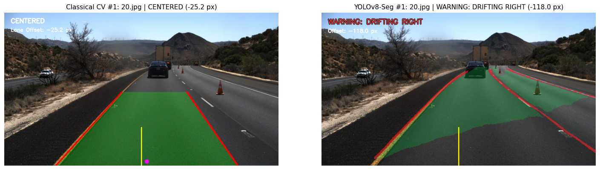

#### Scene 2 Comparison
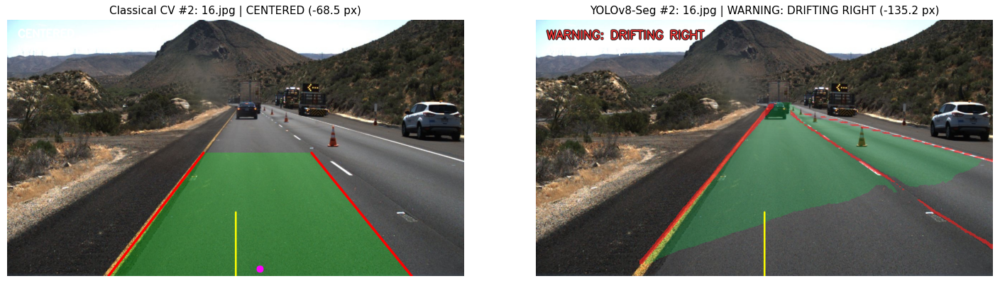

#### Scene 3 Comparison
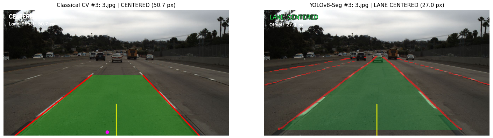

#### Scene 4 Comparison
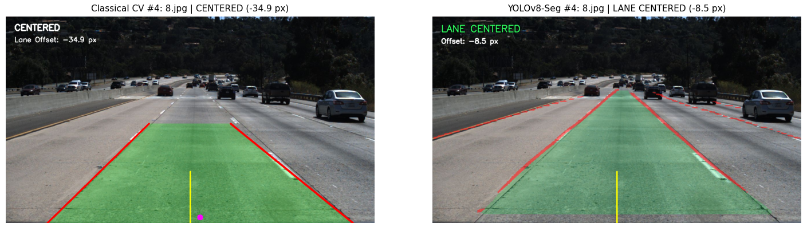

#### Scene 5 Comparison
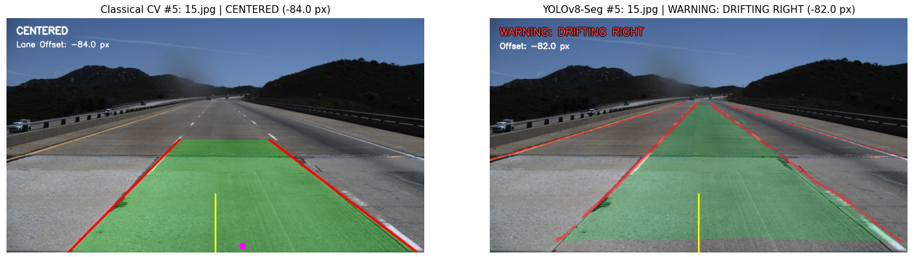

#### Scene 6 Comparison
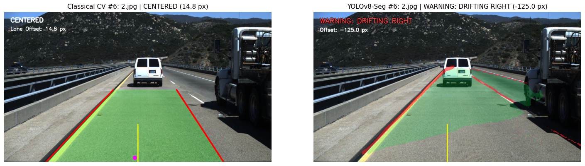

---

## 📊 Quantitative Evaluation & Benchmarks

### 1. Test Frame Detection & Offset Summary

| Scene File | Classical Left Fit | Classical Right Fit | Classical Status | Classical Offset | YOLO Status | YOLO Offset |
| :--- | :---: | :---: | :---: | :---: | :---: | :---: |
| **Scene 1** (`20.jpg`) | ✅ True | ✅ True | `CENTERED` | -25.20 px | `WARNING: DRIFTING RIGHT` | -118.00 px |
| **Scene 2** (`16.jpg`) | ✅ True | ✅ True | `CENTERED` | -68.49 px | `WARNING: DRIFTING RIGHT` | -135.25 px |
| **Scene 3** (`3.jpg`)  | ✅ True | ✅ True | `CENTERED` | +50.74 px | `LANE CENTERED` | +27.00 px |
| **Scene 4** (`8.jpg`)  | ✅ True | ✅ True | `CENTERED` | -34.95 px | `LANE CENTERED` | -8.50 px |
| **Scene 5** (`15.jpg`) | ✅ True | ✅ True | `CENTERED` | -84.00 px | `WARNING: DRIFTING RIGHT` | -82.00 px |
| **Scene 6** (`2.jpg`)  | ✅ True | ✅ True | `CENTERED` | +14.82 px | `WARNING: DRIFTING RIGHT` | -125.00 px |

### 2. Real-Time Inference Latency (50 Frame Benchmark)

| Pipeline | Hardware | Per-Frame Latency | Throughput (FPS) | Real-Time Capable (>= 30 FPS) |
| :--- | :--- | :---: | :---: | :---: |
| **Classical Computer Vision** | CPU / Standard Core | **10.60 ms** | **94.3 FPS** | 🟢 **YES** (3.1x real-time) |
| **YOLOv8-Seg (Deep Learning)**| NVIDIA Tesla T4 GPU | **13.44 ms** | **74.4 FPS** | 🟢 **YES** (2.5x real-time) |

> **Takeaway**: Both pipelines surpass the standard 30 FPS automotive perception requirement by over 2.4×. Classical CV requires zero GPU hardware, while YOLOv8-Seg offers superior semantic scene understanding at over 70 FPS on edge GPUs.

---

## ⚖️ Architectural Trade-Off Analysis

```
                              ┌────────────────────────────────────────┐
                              │      ADAS Perception Dilemma          │
                              └──────────────────┬─────────────────────┘
                                                 │
                        ┌────────────────────────┴────────────────────────┐
                        ▼                                                 ▼
        ┌───────────────────────────────┐                 ┌───────────────────────────────┐
        │     Classical Computer Vision │                 │   Deep Learning (YOLOv8-Seg)  │
        ├───────────────────────────────┤                 ├───────────────────────────────┤
        │ • 0 MB footprint              │                 │ • 6.8 MB model size           │
        │ • Zero training required      │                 │ • End-to-end multi-class seg  │
        │ • Ultra-low CPU compute       │                 │ • GPU acceleration needed     │
        │ • Fragile to shadows/glare    │                 │ • Robust to lighting/occlusion│
        │ • Rigid trapezoidal ROI       │                 │ • Arbitrary road topology     │
        │ • 94.3 FPS on CPU             │                 │ • 74.4 FPS on T4 GPU          │
        └───────────────────────────────┘                 └───────────────────────────────┘
```

### Recommendation Matrix
- **Deploy Classical CV** in cost-sensitive, low-power microcontrollers (e.g., Raspberry Pi, ARM Cortex-A) or Level 1 ADAS where highway conditions are predictable and budget/power is minimal.
- **Deploy YOLOv8-Seg** in production Level 2+ Autonomous Driving stacks requiring free-space segmentation, multi-lane navigation, aggressive curvature tracking, and resilience against weather/shadow artifacts.

---

## 🌐 Real-World Automotive Systems (Tesla, BYD, Mobileye)

In commercial production vehicles (such as **Tesla Autopilot/FSD**, **BYD DiPilot / Xuanji**, **Mobileye EyeQ**, and **NVIDIA DRIVE**), automotive perception is **never pure deep learning alone nor pure classical CV alone**. Production Tier-1 OEMs deploy a **Hybrid Multi-Tier Architecture** that pairs the pattern-recognition power of neural networks with the mathematical determinism, safety guarantees, and real-time efficiency of classical computer vision and control theory.

### Why Production Vehicles Use Hybrid Architectures

| Engineering Dimension | Deep Learning Role | Classical CV & Control Theory Role | Why Both Are Mandatory |
| :--- | :--- | :--- | :--- |
| **Semantic Extraction** | Robustly identifies complex lanes, road boundaries, curb geometries, and weathered markings | Weak when rules are violated (e.g. tar streaks, unusual paint colours) | Neural networks excel at unstructured semantic understanding across edge cases. |
| **Functional Safety (ISO 26262)** | "Black-box" nature prevents formal mathematical proof of zero failure | Deterministic rules satisfy strict **ASIL-B/D** functional safety compliance | If a neural net experiences confidence drop or hallucinates, classical rules act as a hard safety fallback. |
| **Temporal Stability & Jitter** | Can produce slight frame-to-frame mask boundary flicker | Extended Kalman Filters (EKF), Particle Filters, & Clothoid Splines | Direct neural mask outputs cause steering wheel shudder; classical filters ensure silky-smooth steering. |
| **Physical Kinematics** | Predicts spatial lane points in pixel or 3D space | Enforces road curvature limits ($a_{lat} \le \frac{v^2}{R}$) and vehicle dynamics | Rejects unphysical steering angles or impossible lateral trajectory jumps. |
| **Compute & Redundancy** | Executes on high-power NPU/GPU domain processors (e.g. Orin-X, Tesla HW4) | Executes on ultra-reliable, lock-step safety microcontrollers (e.g. Infineon AURIX) | Provides dual-channel algorithmic and hardware redundancy for failsafe operation. |

---

### Industry Implementation Profiles

#### 1. ⚡ Tesla Vision (Autopilot & Full Self-Driving)
- **Deep Learning Layer**:
  - Tesla ingests 8 synchronized camera video streams into deep neural networks (RegNet/BiFPN backbones with spatial & temporal Transformers).
  - Neural networks construct a 3D Bird's-Eye-View (BEV) vector space and Occupancy Network voxel grid, classifying lane lines, road edges, and dynamic obstacles simultaneously.
- **Classical CV & Geometry Integration**:
  - **Parametric Spline Fitting**: Discrete neural lane points are fitted to **cubic clothoid splines** ($x = ay^3 + by^2 + cy + d$), the mathematical curve standard used in civil road engineering.
  - **Convex Optimization**: Path planners use Quadratic Programming (QP) and Model Predictive Control (MPC) constrained by classical vehicle kinematic models (Ackermann steering geometry).
  - **Kinematic Plausibility Filters**: If neural predictions imply lateral accelerations exceeding passenger comfort limits ($>0.2g$), the planner clamps the trajectory using deterministic safety bounds.

#### 2. 🔋 BYD DiPilot & Xuanji Architecture
- **Hierarchical Domain Architecture**:
  - BYD couples AI domain controllers (NVIDIA DRIVE Orin-X / Horizon Robotics Journey 5) with automotive safety microcontrollers (e.g., Infineon AURIX TC397).
- **Hybrid Fusion Engine**:
  - **DL Semantic Segmentation**: Deploys lightweight segmentation networks (conceptually similar to the YOLOv8-Seg pipeline demonstrated here) to classify lane lines and segment drivable road surface in real time.
  - **Classical Feature & Edge Verification**: High-contrast Sobel/Canny gradient trackers and vanishing-point horizon estimation cross-validate lane geometry in high-glare or tunnel entrance/exit conditions where neural contrast may degrade.
  - **Camera + Millimeter-Wave Radar Fusion**: An Extended Kalman Filter (EKF) fuses radar point velocities with visual lane corridors, preventing phantom braking and false lane departures.
  - **ASIL-D Watchdog Channel**: A deterministic classical CV pipeline runs in the background. If the primary deep model encounters high latency or out-of-distribution (OOD) uncertainty, the vehicle cleanly drops to classical lane-centering or alerts the driver.

#### 3. 👁️ Mobileye (EyeQ Architecture & True Redundancy™)
- Deployed on over 150 million vehicles worldwide (BMW, Ford, Geely/Zeekr, Volkswagen, Nissan).
- Mobileye pioneered the industry standard **True Redundancy™** concept:
  - **Dual-Engine Vision Pipeline**: Combines deep neural nets (REM - Road Experience Management) with classical monocular depth estimation, structure-from-motion (SfM), and optical flow.
  - **RSS (Responsibility-Sensitive Safety)**: A mathematically provable, deterministic classical safety model developed by Mobileye that sits between the perception stack and vehicle actuators, mathematically guaranteeing that no perception error can command an unsafe driving maneuver.

---

### Universal Hybrid ADAS Perception Architecture

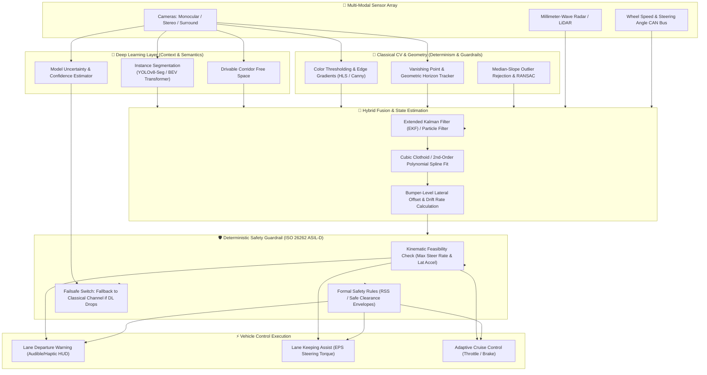

---

## 🛠️ Pipeline 1: Classical Computer Vision

Implemented in [`laneguard.ipynb`](laneguard.ipynb), this pipeline employs deterministic algorithmic vision principles without neural network weights.

```mermaid
flowchart LR
    A[RGB Image] --> B[HLS White/Yellow Filter]
    B --> C[Gaussian Blur & Canny Edge]
    C --> D[Trapezoidal ROI Mask]
    D --> E[Probabilistic Hough Lines]
    E --> F[Slope Separation & Outlier Rejection]
    F --> G[Single-Lane Occlusion Synthesis]
    G --> H[Polynomial Fit & Corridor Overlay]
    H --> I[Lateral Offset & LDWS HUD]
```

### Classical Vision Processing Steps

1. **Color Space Filtering**:
   - Isolates white lane markings using lightness thresholding in HLS space: $L \in [200, 255]$.
   - Isolates yellow lane markings using combined bounds: $H \in [15, 30]$, $L \in [115, 255]$, $S \in [50, 255]$.
   - Blends bitwise mask with grayscale representation.
2. **Canny Edge Detection**:
   - Applies $5 \times 5$ Gaussian kernel ($\sigma = 1.5$) followed by gradient hysteresis ($T_{low} = 50$, $T_{high} = 150$).
3. **Trapezoidal Region of Interest (ROI)**:
   - Dynamic geometric polygon tailored to vehicle hood height:
     - Bottom vertices: $(0.05 \times W, H)$ and $(0.95 \times W, H)$
     - Top vertices: $(0.42 \times W, 0.60 \times H)$ and $(0.58 \times W, 0.60 \times H)$
4. **Probabilistic Hough Transform**:
   - Parameterized with $\rho = 2$ px, $\theta = \pi/180$, threshold $= 40$, min line length $= 40$ px, max gap $= 100$ px.
5. **Slope Separation & Outlier Filtering**:
   - Left lines: $slope \in [-1.2, -0.4]$
   - Right lines: $slope \in [0.4, 1.2]$
   - Computes median slope and discards outliers beyond $\pm 0.25$ radians.
6. **Single-Lane Occlusion Recovery**:
   - If one lane boundary is occluded by passing vehicles, synthesizes the missing boundary using standard highway width ($W_{lane} \approx 700$ px).
7. **Curved Lane Polynomial Fit**:
   - Fits a 2nd-degree polynomial $x = ay^2 + by + c$ through Hough segment endpoints.
8. **Temporal Smoothing**:
   - Exponential Moving Average (`LaneSmoother`, $\alpha = 0.25$) stabilizes frame-to-frame video flicker.

### Classical Pipeline Visual Gallery

| Preprocessing Stages | Canny Edge Detection |
| :---: | :---: |
|  | 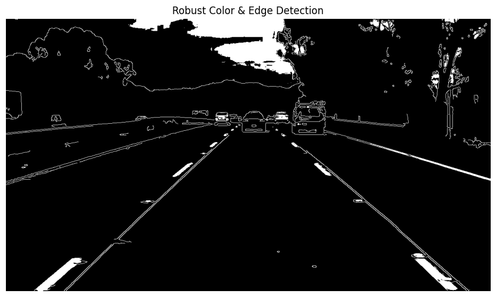 |
| **ROI Masked Edges** | **Hough Line Detection** |
| 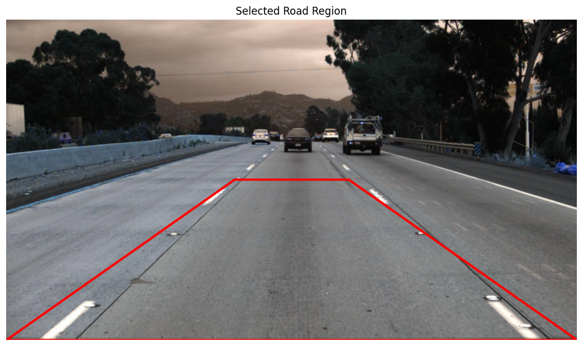 | 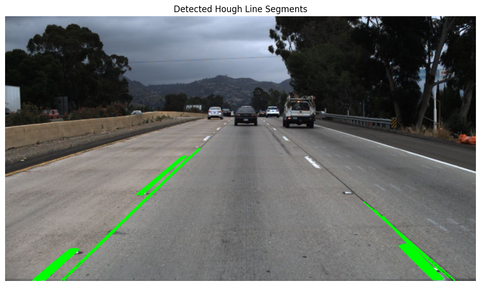 |
| **Fitted Lane Boundaries** | **Drivable Corridor Overlay** |
| 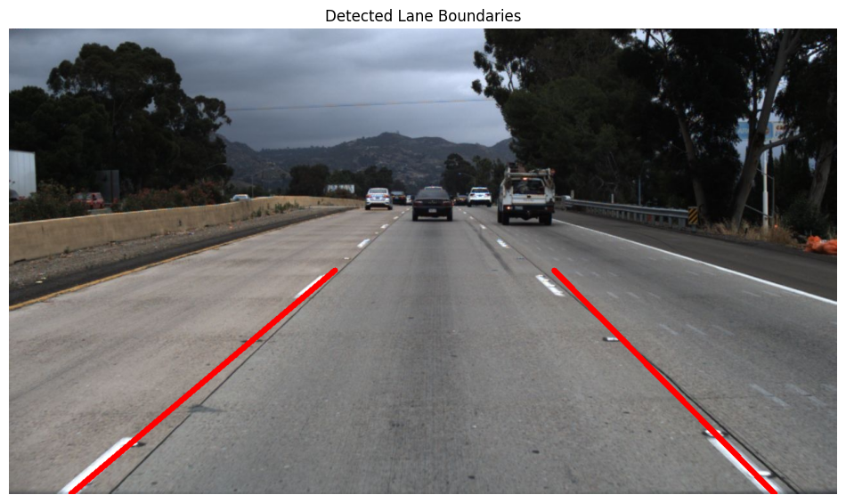 |  |
| **Departure Warning HUD** | **Curved Lane Polynomial Fit** |
|  | 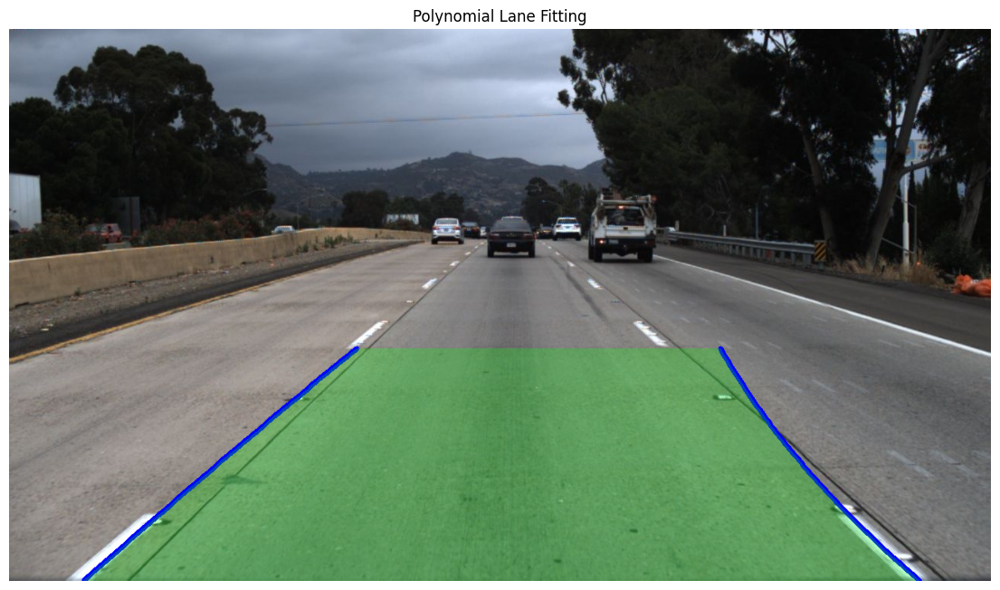 |

---

## 🧠 Pipeline 2: Deep Learning (YOLOv8-Seg)

Implemented in [`laneguard_yolo.ipynb`](laneguard_yolo.ipynb), this pipeline converts the TuSimple dataset into polygon segmentation masks and trains an Ultralytics YOLOv8 instance segmentation network.

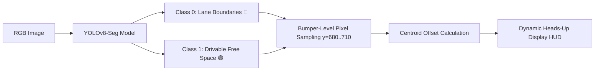

### Deep Learning Highlights

- **Dual-Class Segmentation**:
  - **Class 0 (`lane_line`)**: Segmented road boundary lines (rendered in bright red: `RGB(255, 30, 30)`).
  - **Class 1 (`drivable_corridor`)**: Polygon area between inner boundary lines indicating valid vehicular passage (rendered in emerald green: `RGB(0, 230, 70)`).
- **TuSimple to YOLO Polygon Converter**:
  - Automatically transforms discrete TuSimple sparse polyline coordinates (`label_data_*.json`) into closed bounding polygon masks normalized to $[0, 1]$.
- **Bumper-Level Lane Departure HUD**:
  - Evaluates mask boundaries at vehicle bumper level ($y \in [680, 710]$ px).
  - Calculates vehicle offset: $\Delta x = x_{vehicle} - x_{lane\_center}$.
  - Triggers alerts:
    - $|\Delta x| \le 80$ px: `LANE CENTERED` (Green HUD)
    - $\Delta x > 80$ px: `WARNING: DRIFTING LEFT` (Amber HUD)
    - $\Delta x < -80$ px: `WARNING: DRIFTING RIGHT` (Amber HUD)

### YOLOv8-Seg Multi-Scene Visual Results


---

## 📁 Repository Structure

```text
├── assets/
│   ├── classical/                  # 18 extracted classical CV pipeline figures
│   │   ├── 01_ground_truth_lanes.png
│   │   ├── 03_preprocessing_stages.png
│   │   ├── 04_canny_edges.png
│   │   ├── 06_roi_masked_edges.png
│   │   ├── 07_hough_lines.png
│   │   ├── 08_fitted_lane_lines.png
│   │   ├── 09_lane_corridor_overlay.png
│   │   ├── 11_departure_warning_hud.png
│   │   └── 12_polynomial_curved_lane_fit.png
│   ├── comparison/                 # Side-by-side comparison images
│   │   ├── comparison_full_grid.png
│   │   ├── laneguard_comparison_grid.png
│   │   ├── laneguard_conclusion_grid.png
│   │   ├── scene_1_comparison.png ... scene_6_comparison.png
│   │   ├── scene_1_classical.png  ... scene_6_classical.png
│   │   └── scene_1_yolo.png       ... scene_6_yolo.png
│   └── yolo/                       # Deep learning segmentation outputs
│       └── yolov8_segmentation_results_grid.png
├── laneguard.ipynb                 # Classical CV end-to-end pipeline notebook
├── laneguard_yolo.ipynb            # YOLOv8-Seg dataset prep, training & HUD notebook
├── laneguard_comparison.ipynb      # Side-by-side empirical comparison notebook
├── laneguard_conclusion.ipynb      # Standalone benchmark & evaluation conclusion notebook
└── README.md                       # Master documentation & visual benchmark report
```

---

## 💻 Installation & Getting Started

### 1. Clone the Repository
```bash
git clone https://github.com/AskariSyed/Lane_Guard.git
cd Lane_Guard
```

### 2. Create and Activate Environment
```bash
python -m venv venv
# Windows:
venv\Scripts\activate
# Linux/macOS:
source venv/bin/activate
```

### 3. Install Dependencies
```bash
pip install opencv-python numpy matplotlib pandas ultralytics torch torchvision
```

### 4. Running the Notebooks
Launch Jupyter or open directly in VS Code / Kaggle:
- **`laneguard.ipynb`**: Run all cells to execute classical edge, Hough, and LDWS processing.
- **`laneguard_yolo.ipynb`**: Converts TuSimple labels and runs YOLOv8-Seg inference.
- **`laneguard_conclusion.ipynb`**: Executes the unified benchmark and real-time latency timer across both models.

---

## 📚 Citation & References

- **TuSimple Benchmark**: [TuSimple Lane Detection Challenge](https://github.com/TuSimple/tusimple-benchmark)
- **Ultralytics YOLOv8**: Jocher, G., Chaurasia, A., & Qiu, J. (2023). *Ultralytics YOLO* (Version 8.0.0). [https://github.com/ultralytics/ultralytics](https://github.com/ultralytics/ultralytics)
- **OpenCV**: Bradski, G. (2000). *The OpenCV Library*. Dr. Dobb's Journal of Software Tools.
- **Mobileye RSS**: Shalev-Shwartz, S., Shammah, S., & Shashua, A. (2017). *On a Formal Model of Safe and Scalable Self-driving Cars*. arXiv:1708.06374.

---

<p align="center">
  <b>Developed for Autonomous Driving Perception & ADAS Safety Research</b><br>
  Designed & Engineered by <a href="https://github.com/AskariSyed">Syed Askari</a>
</p>
